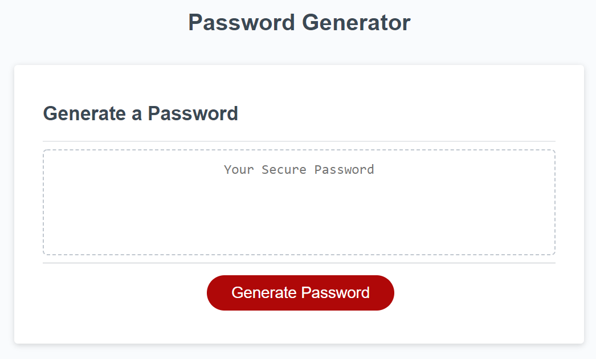

# password-generator

Please view the application here: https://thetinaest.github.io/password-generator/

## Description of project
This is a challenge for the UW coding bootcamp. The logic is written using JavaScript.

##
Upon loading this webpage and clicking the "generate password" button, you will be prompted to set a length for your password. Then you will be asked what type of characters you would like to possibly be in your randomly generated password. The webpage will then print a password for you based on your preferences.